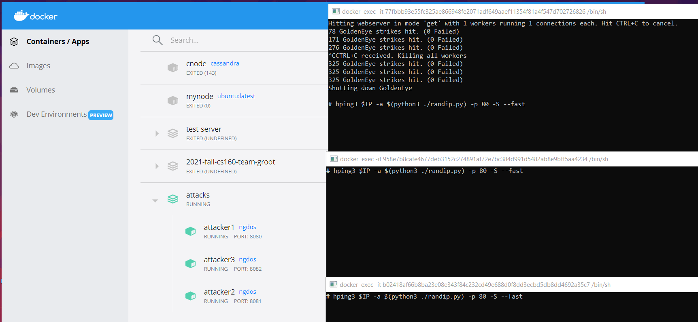

# Running the attacks with Docker

GoldenEye will need to be cloned from its repository. Once done, the Dockerfile will automatically carry it into the container.
```
git clone https://github.com/jseidl/GoldenEye.git
```
After getting GoldenEye, you'll need to build the image.
```
docker build -t ngdos -f ATK.Dockerfile .
```
The containers can be launched with the docker compose tool. The compose file can be configured to suit attacking needs, the attacks will need to be manually turned on once the containers are built.
The --env-file flag is unnecessary, but you'll need an env file with a URL to target.
```
docker-compose --env-file ./.env up
```
There may be issues running the scripts in the shell. The ubuntu image was latest at the point of this upload, running the commands directly may be a better option. For reference, here's how my default set-up looks like, visualized with Docker Desktop.

