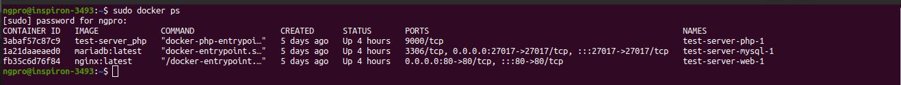

# Launching the Server
To prepare the server, launch with the command. You'll need the provided environment file.
```
docker-compose --env-file ./.env.dev up
```


To access the MariaDB server, access the container via the CLI and enter the password in the .env.dev file. It should default to root.
```
mysql --password
```
If you haven't built the volume before, you'll need to run the SQL files through the CLI to create the tables (You can just copy and paste the commands). Once created, the website can be accessed through localhost: 127.0.0.1 (Localhost redirects to the Nginx server page).

Docker set-up created from: https://www.sitepoint.com/docker-php-development-environment/

REST API set-up based on: https://code.tutsplus.com/tutorials/how-to-build-a-simple-rest-api-in-php--cms-37000

# Interacting with the REST API
We can process a few requests through URL, simplifying the process for interacting over the command prompt. Here are a few commands using curl.

Get an image $IMGNAME with the associated $IDNO
```
curl "URL/index.php?action=image&id=$IDNO" > $IMGNAME
```

Note that these will need to be implemented in Python for the attack scripts.
